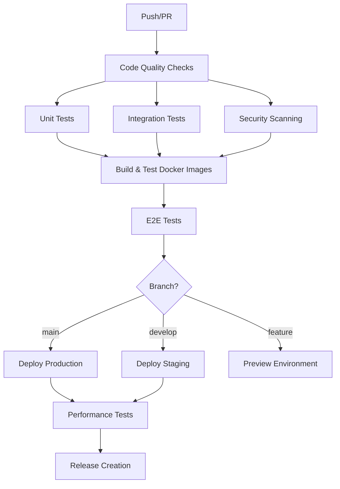

# CI/CD Pipeline Documentation

This document provides comprehensive information about the CI/CD pipeline setup for kAInban, including automated testing, code quality checks, and deployment processes.

## Table of Contents

- [Overview](#overview)
- [Pipeline Architecture](#pipeline-architecture)
- [Workflows](#workflows)
- [Testing Strategy](#testing-strategy)
- [Code Quality](#code-quality)
- [Security Scanning](#security-scanning)
- [Deployment](#deployment)
- [Performance Testing](#performance-testing)
- [Local Development](#local-development)
- [Troubleshooting](#troubleshooting)

## Overview

The kAInban project uses **GitHub Actions** for CI/CD with a comprehensive pipeline that includes:

- ✅ **Automated Testing** (Unit, Integration, E2E)
- 🔍 **Code Quality Checks** (ESLint, Prettier, TypeScript)
- 🛡️ **Security Scanning** (Dependency audit, Code vulnerability scanning)
- 📊 **Performance Testing** (Lighthouse CI, Load testing)
- 🚀 **Automated Deployment** (Docker-based, multi-environment)
- 📋 **Release Management** (Semantic versioning, automated releases)

## Pipeline Architecture



## Workflows

### 1. Main CI Pipeline (`.github/workflows/ci.yml`)

**Triggers:**
- Push to `main`, `develop`, `users` branches
- Pull requests to `main`

**Jobs:**
1. **Code Quality** - ESLint, Prettier, security audit
2. **Frontend Tests** - Unit tests with coverage
3. **Backend Tests** - API tests with database
4. **E2E Tests** - Full application testing with Playwright
5. **Security Scan** - Trivy, CodeQL analysis
6. **Docker Build** - Multi-stage builds with caching
7. **Performance Tests** - Lighthouse CI, load testing
8. **Deploy Production** - Production deployment (main branch only)
9. **Deploy Staging** - Staging deployment (develop branch only)

### 2. Release Pipeline (`.github/workflows/release.yml`)

**Triggers:**
- Git tags matching `v*` (e.g., `v1.2.3`)

**Jobs:**
1. **Create Release** - Generate changelog, create GitHub release
2. **Build Release Images** - Multi-platform Docker images
3. **Build Distributions** - Platform-specific archives
4. **Update Documentation** - Version updates
5. **Notify Release** - Slack/Discord notifications

### 3. Code Quality Pipeline (`.github/workflows/code-quality.yml`)

**Triggers:**
- Push to any branch
- Pull requests

**Jobs:**
1. **Lint and Format** - ESLint, Prettier checks
2. **Security Audit** - npm audit, vulnerability scanning
3. **Dependency Check** - Outdated packages, bundle size
4. **Code Coverage** - Test coverage analysis
5. **Accessibility Check** - a11y compliance testing

## Testing Strategy

### Unit Tests (Vitest)

**Location:** `src/test/`
**Configuration:** `vitest.config.js`

```bash
# Run unit tests
npm run test

# Run with coverage
npm run test:coverage

# Watch mode
npm run test:watch

# UI mode
npm run test:ui
```

**Coverage Thresholds:**
- Branches: 70%
- Functions: 70%
- Lines: 70%
- Statements: 70%

### Integration Tests (Backend)

**Location:** `server/tests/`
**Configuration:** `server/vitest.config.js`

```bash
# Run backend tests
npm run test:backend

# Run API tests
npm run test:api
```

### End-to-End Tests (Playwright)

**Location:** `e2e/`
**Configuration:** `playwright.config.js`

```bash
# Run E2E tests
npm run test:e2e

# Run with UI
npm run test:e2e:ui

# Run headed (visible browser)
npm run test:e2e:headed
```

**Test Coverage:**
- Authentication flows
- Dashboard functionality
- Project management
- Task creation and management
- Audio processing workflows
- Mobile responsiveness

### Performance Tests

**Lighthouse CI:**
- Performance score > 80%
- Accessibility score > 90%
- Best practices score > 80%
- SEO score > 80%
- PWA score > 60%

**Load Testing (k6):**
```bash
npm run test:load
```

- Tests up to 20 concurrent users
- 95% of requests < 500ms
- Error rate < 2%

## Code Quality

### ESLint Configuration (`.eslintrc.js`)

**Rules:**
- React/JSX best practices
- Accessibility requirements (jsx-a11y)
- Import/export organization
- Code style consistency
- Performance optimizations

**Custom Rules:**
- No console.log in production
- Proper React hooks usage
- Accessibility compliance
- Import ordering

### Prettier Configuration (`.prettierrc`)

**Style:**
- Single quotes
- No semicolons
- 2-space indentation
- Line width: 80 characters
- Trailing commas: none

### Pre-commit Hooks (Husky)

Automatically runs on every commit:
1. **lint-staged** - Lint and format changed files
2. **Type checking** - TypeScript validation
3. **Unit tests** - Ensure tests pass

```bash
# Setup hooks
npm run prepare

# Manual run
npm run pre-commit
```

## Security Scanning

### Dependency Scanning

**Tools:**
- `npm audit` - Built-in vulnerability scanner
- `audit-ci` - CI-friendly audit tool
- **Trivy** - Container vulnerability scanner
- **CodeQL** - Semantic code analysis

**Configuration:** `audit-ci.json`

### Security Policies

1. **Critical/High vulnerabilities** - Block CI
2. **Moderate vulnerabilities** - Warning only
3. **Regular dependency updates** - Dependabot
4. **Container scanning** - All Docker images
5. **SAST scanning** - Source code analysis

## Deployment

### Environments

#### 1. Production (`main` branch)
- **URL:** `https://kainban.production.com`
- **Auto-deploy:** On push to main
- **Health checks:** Required
- **Rollback:** Automatic on failure

#### 2. Staging (`develop` branch)
- **URL:** `https://kainban.staging.com`
- **Auto-deploy:** On push to develop
- **Testing:** Full E2E suite
- **Data:** Sanitized production data

#### 3. Preview (Feature branches)
- **URL:** `https://pr-{number}.kainban.preview.com`
- **Auto-deploy:** On PR creation
- **Duration:** 7 days after PR close
- **Sharing:** Public preview links

### Docker Deployment

**Multi-stage builds:**
```dockerfile
# Frontend stage
FROM node:20-alpine as frontend
# ... build frontend

# API stage
FROM node:20-alpine as api
# ... build API

# Production stage
FROM nginx:alpine as production
# ... combine builds
```

**Deployment command:**
```bash
# Production
APP_URL=https://kainban.com API_URL=https://kainban.com/api docker compose up -d

# Staging
APP_URL=https://staging.kainban.com API_URL=https://staging.kainban.com/api docker compose -f docker-compose.staging.yml up -d
```

### Health Checks

**Endpoints:**
- `GET /api/health` - API health
- `GET /` - Frontend availability
- `GET /api/auth/status` - Authentication status

**Monitoring:**
- Response time < 500ms
- 99.9% uptime requirement
- Error rate < 0.1%

## Performance Testing

### Lighthouse CI

**Configuration:** `lighthouserc.js`

**Metrics:**
- **Performance:** Page load speed, Core Web Vitals
- **Accessibility:** Screen reader, keyboard navigation
- **Best Practices:** Security, modern web standards
- **SEO:** Meta tags, structured data
- **PWA:** Service worker, manifest

**Thresholds:**
- Performance: 80+ (warn)
- Accessibility: 90+ (error)
- Best Practices: 80+ (warn)
- SEO: 80+ (warn)
- PWA: 60+ (warn)

### Load Testing

**Tool:** k6
**Configuration:** `load-tests/basic-load-test.js`

**Test Scenarios:**
1. **Homepage load** - Static content delivery
2. **Authentication** - Login/logout flows
3. **API endpoints** - CRUD operations
4. **File uploads** - Audio processing
5. **Real-time updates** - WebSocket connections

**Performance Targets:**
- Response time: 95th percentile < 500ms
- Throughput: 100 requests/second
- Error rate: < 2%
- Concurrent users: 50+

## Local Development

### Setup

```bash
# Install dependencies
npm install

# Setup git hooks
npm run prepare

# Run development server
npm run dev
```

### Testing Locally

```bash
# Run all tests
npm run test:all

# Individual test suites
npm run test:frontend
npm run test:backend
npm run test:e2e

# Code quality
npm run lint
npm run format:check

# Security
npm audit
```

### Docker Development

```bash
# Build and start
docker compose up -d --build

# View logs
docker compose logs -f

# Run tests in container
docker compose exec frontend npm test
docker compose exec api npm test
```

## Troubleshooting

### Common Issues

#### 1. Tests Failing Locally

```bash
# Clear cache
npm run clean
rm -rf node_modules
npm install

# Reset test database
rm server/storage/test.db

# Update snapshots
npm run test -- --update
```

#### 2. Docker Build Issues

```bash
# Clear Docker cache
docker builder prune

# Build without cache
docker compose build --no-cache

# Check logs
docker compose logs api
```

#### 3. CI Pipeline Failures

**ESLint Errors:**
```bash
# Fix automatically
npm run lint:fix

# Check specific files
npx eslint src/components/Header.jsx
```

**Test Failures:**
```bash
# Run specific test
npm test -- --run src/test/components/Header.test.jsx

# Debug mode
npm test -- --inspect-brk
```

**Deployment Issues:**
- Check environment variables
- Verify Docker image tags
- Review health check endpoints
- Check resource limits

#### 4. Performance Issues

**Lighthouse Failures:**
- Optimize images (WebP, lazy loading)
- Reduce JavaScript bundle size
- Implement caching strategies
- Fix accessibility issues

**Load Test Failures:**
- Check database connection pooling
- Optimize API response times
- Review memory usage
- Scale horizontally

### Debugging CI/CD

#### GitHub Actions Debugging

```yaml
# Add debug step
- name: Debug Environment
  run: |
    echo "Node version: $(node --version)"
    echo "NPM version: $(npm --version)"
    echo "Current directory: $(pwd)"
    ls -la
    env | grep -E '^(GITHUB_|RUNNER_|NODE_)'
```

#### Docker Debugging

```bash
# Debug inside container
docker compose exec api sh

# Check container logs
docker compose logs --tail=50 api

# Inspect container
docker inspect notes-api-1
```

### Best Practices

1. **Always run tests locally** before pushing
2. **Use feature branches** for development
3. **Write descriptive commit messages**
4. **Keep PRs small and focused**
5. **Add tests for new features**
6. **Update documentation** for changes
7. **Monitor CI/CD metrics** regularly
8. **Review security alerts** promptly

### Monitoring and Alerts

**GitHub Actions:**
- Failed workflow notifications
- Performance regression alerts
- Security vulnerability alerts

**Production Monitoring:**
- Uptime monitoring (99.9% SLA)
- Error rate tracking (< 0.1%)
- Response time monitoring (< 500ms)
- Resource usage alerts

**Notification Channels:**
- Slack: `#kainban-deployments`
- Discord: `#ci-cd-alerts`
- Email: Critical issues only

## Continuous Improvement

### Metrics Tracking

1. **Build Times** - Target: < 5 minutes
2. **Test Coverage** - Target: > 80%
3. **Deployment Frequency** - Target: Daily
4. **Lead Time** - Target: < 1 day
5. **Mean Time to Recovery** - Target: < 1 hour

### Regular Maintenance

- **Weekly:** Dependency updates
- **Monthly:** Performance review
- **Quarterly:** Security audit
- **Annually:** Architecture review

### Contributing to CI/CD

See [CONTRIBUTING.md](CONTRIBUTING.md) for guidelines on:
- Adding new tests
- Modifying workflows
- Updating configurations
- Performance optimization

---

*This CI/CD pipeline ensures high code quality, security, and reliability for the kAInban project while enabling rapid, confident deployments.*