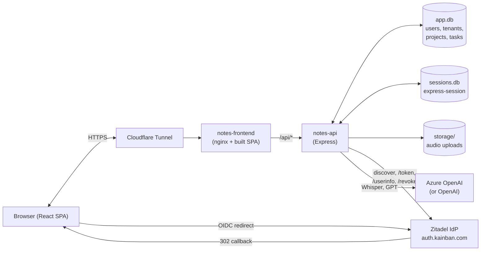
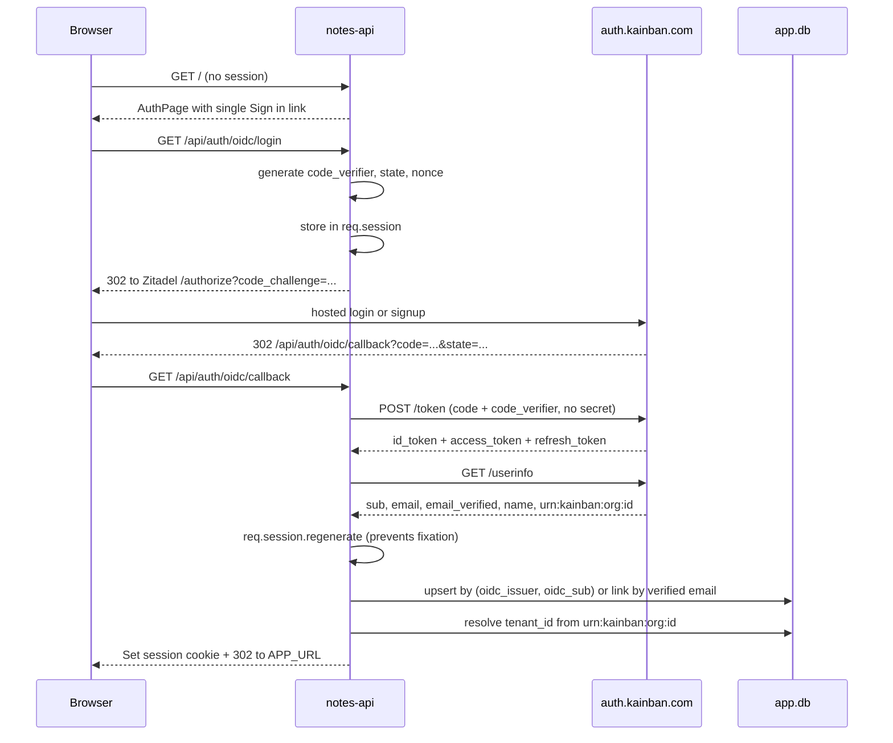
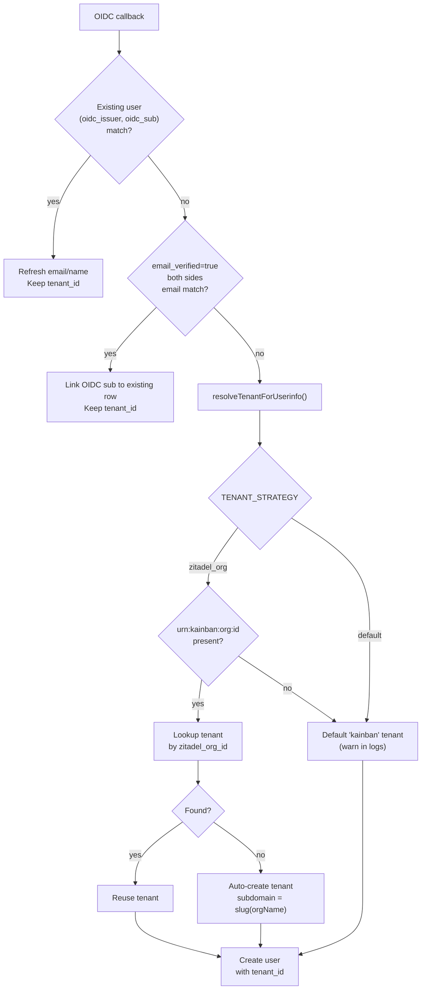
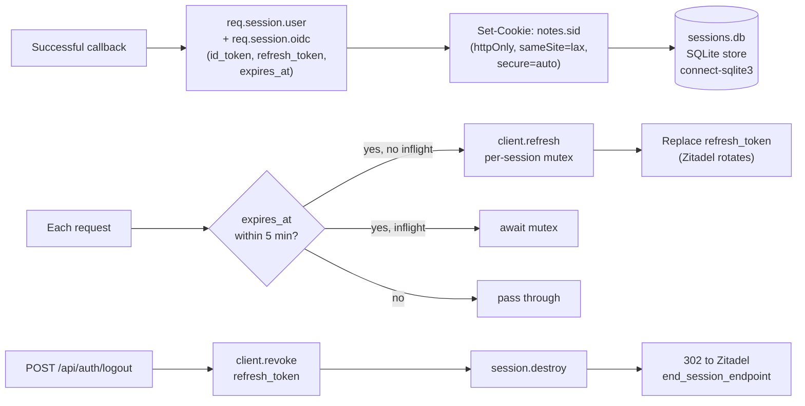

# kAInban - AI-Powered Task Management

> Transform meeting recordings into actionable tasks with AI-powered transcription and intelligent task extraction. A modern, privacy-first task management system with Zitadel OIDC authentication and comprehensive project organization.

[](https://www.gnu.org/licenses/agpl-3.0)
[](https://reactjs.org/)
[](https://azure.microsoft.com/en-us/products/ai-services/openai-service)
[](https://www.docker.com/)
[](https://nodejs.org/)

---

## 📖 Table of Contents

- [Overview](#overview)
- [Features](#features)
- [Architecture](#architecture)
- [Quick Start](#quick-start)
- [Installation](#installation)
- [Configuration](#configuration)
- [Usage](#usage)
- [API Documentation](#api-documentation)
- [Development](#development)
- [Deployment](#deployment)
- [Contributing](#contributing)
- [License](#license)
- [Support](#support)

---

## 🎯 Overview

**kAInban** is a comprehensive AI-powered task management application that transforms meeting recordings and audio notes into organized, actionable tasks on an intelligent Kanban board. Built with modern web technologies and designed for both personal productivity and team collaboration.

### Key Benefits

- 🎤 **Audio-to-Tasks**: Transform meeting recordings into structured task lists
- 🤖 **AI Intelligence**: Advanced task extraction with status detection and prioritization
- 📊 **Analytics Dashboard**: Gain insights into your productivity patterns with AI recommendations
- 🔒 **Privacy-First**: Self-hosted with Zitadel OIDC authentication (hosted login)
- 📱 **Mobile-Optimized**: Responsive design that works on all devices
- 🎨 **Modern UI**: Beautiful, intuitive interface with dark mode support

### Perfect for:

- 📝 **Meeting Management**: Automatically extract action items from recordings
- 🎯 **Project Planning**: Break down complex projects into manageable tasks
- 🤝 **Team Collaboration**: Share projects and assign tasks to team members
- 📊 **Productivity Tracking**: Analyze work patterns with AI-powered insights
- 🔒 **Privacy-Conscious Users**: Complete control over your data

---

## ✨ Features

### 🎤 Audio Processing & AI Intelligence

- **Live Recording**: Real-time audio capture with visual feedback
- **File Upload Support**: MP3, MP4, M4A, WAV, WebM, OGG formats
- **AI Transcription**: High-accuracy speech-to-text via Azure OpenAI or OpenAI Whisper
- **Smart Task Extraction**: Intelligent detection of tasks, statuses, and priorities
- **Meeting Summaries**: Structured summaries with key decisions and action items
- **Large File Handling**: Automatic chunking for files >25MB

### 📋 Task & Project Management

- **Kanban Board**: Drag-and-drop interface with customizable columns
- **Project Organization**: Multiple projects with isolated tasks and settings
- **Rich Task Details**: Priorities, due dates, assignees, descriptions with markdown
- **Task Status Tracking**: Automatic status detection from meeting context
- **Related Task Detection**: AI identifies tasks that should be updated together

### 📊 Analytics & Insights

- **Analytics Dashboard**: Comprehensive overview of all projects and tasks
- **AI Task Recommendations**: Daily insights powered by intelligent analysis
  - 🎯 Focus recommendations for the week
  - ✅ Quick wins to build momentum
  - ⚠️ Urgent items requiring attention
- **Smart Caching**: Daily refresh with task count-based updates
- **Project Filtering**: View analytics for all projects or specific ones

### 🔐 Authentication & Security

- **Zitadel OIDC**: Hosted-login PKCE flow - signup, email verification,
  and password reset all happen at the IdP; kAInban never sees passwords
- **Role-Based Access**: Admin and member roles with appropriate permissions
- **Bootstrap Admin**: First user matching `ZITADEL_BOOTSTRAP_ADMIN_EMAILS`
  becomes admin on first login (one-shot guard - inert once an admin exists)
- **Multi-Tenant**: Optional Zitadel-org -> kAInban-tenant mapping via a
  custom claim Action (see `Zitadel Setup`)
- **Local-Auth Fallback**: Email + password login can be re-enabled per-route
  via `LOCAL_LOGIN_FALLBACK` / `LOCAL_REGISTER_FALLBACK` env flags for
  rollback scenarios where the IdP is unavailable
- **User Management**: Admin interface for managing users and permissions

### 🎨 Modern User Experience

- **Responsive Design**: Optimized for desktop, tablet, and mobile devices
- **Dark Mode Support**: System-aware theme switching
- **Smooth Animations**: Beautiful transitions powered by Framer Motion
- **Progressive Web App**: Install as a mobile app with offline capabilities
- **Touch-Optimized**: Mobile-first interactions and gestures

### 🏗️ Technical Excellence

- **Docker Deployment**: Production-ready containerization
- **RESTful API**: Well-documented backend API
- **Real-time Updates**: Live synchronization across devices
- **Error Handling**: Comprehensive error management with user feedback
- **Performance Optimized**: Lazy loading, caching, and efficient rendering

---

## 🏗 Architecture

### Topology

Two containers behind a reverse proxy. SQLite is the source of truth for app
data and sessions; Zitadel handles all identity. Audio uploads go to local
disk and are pulled by Whisper for transcription.



### Sign-in flow (Zitadel hosted login, PKCE)



### Tenant resolution

A custom Zitadel Action (`addOrgClaims`) on the Complement Token flow
injects `urn:kainban:org:id` into id_token and userinfo. The backend reads
that claim and routes new users into a tenant keyed by the Zitadel org id.



The current production setup has `TENANT_STRATEGY=zitadel_org` and a single
`kainban` tenant whose `zitadel_org_id` is backfilled to the canonical
kAInban Zitadel org id. This means: any future user signing up in the same
org joins the existing tenant; if a separate Zitadel org is ever added, its
first user auto-spawns its own tenant.

### Session and token lifecycle



Refresh failures fall through with the existing access token (don't 401 the
user on a transient blip). The per-session in-process mutex prevents N
concurrent requests from each firing a refresh and rotating each other's
tokens to invalid.

---

## 🚀 Quick Start

### Prerequisites

- **Docker & Docker Compose** (recommended)
- **Node.js 20+** (for development)
- **An AI provider account** — one of:
  - **Azure OpenAI** with Whisper + GPT deployments, _or_
  - **OpenAI** (or any OpenAI-compatible endpoint: OpenRouter, LiteLLM, vLLM)
- **Zitadel** instance (self-hosted or SaaS - required for hosted login;
  see `Zitadel Setup` below)

### 1-Minute Setup

```bash
# Clone the repository
git clone https://github.com/yourusername/kainban.git
cd kainban

# Copy environment template
cp .env.example .env

# Edit .env with your credentials (see Configuration section)

# Start with Docker
docker compose up -d

# Access at http://localhost:3000
```

---

## 🛠️ Installation

### Option 1: Docker (Recommended)

```bash
# Clone and navigate
git clone https://github.com/yourusername/kainban.git
cd kainban

# Configure environment
cp .env.example .env
# Edit .env with your settings

# Build and start
docker compose up -d --build

# View logs
docker compose logs -f
```

### Option 2: Local Development

```bash
# Clone repository
git clone https://github.com/yourusername/kainban.git
cd kainban

# Install dependencies
npm install

# Configure environment
cp .env.example .env
# Edit .env with your settings

# Start development server
npm run dev

# Access at http://localhost:3000
```

---

## ⚙️ Configuration

### Environment Variables

Create a `.env` file with the following configuration:

```env
# === AI Provider (server-side; env wins over Settings UI) ===
# Resolution precedence is env-first:
#   1. process.env  (set here) — wins when non-empty
#   2. DB settings  — per-user values saved via the Settings dialog
#   3. defaults     — hard-coded fallbacks
#
# Set the key here and the Settings dialog renders the corresponding fields
# read-only with an "env" badge. Clear the env var (or comment it out and
# restart the api container) to manage from the UI again.
#
# AI_PROVIDER picks the active provider. "azure" (default) or "openai".
# If only OPENAI_API_KEY is set, the platform assumes "openai".
AI_PROVIDER=azure

# --- Azure OpenAI (default) ---
AZURE_OPENAI_ENDPOINT=https://your-resource.openai.azure.com
AZURE_OPENAI_API_KEY=your-api-key-here
AZURE_OPENAI_API_VERSION=2024-02-01
AZURE_OPENAI_WHISPER_DEPLOYMENT=whisper
AZURE_OPENAI_GPT_DEPLOYMENT=gpt-4o

# --- OpenAI (or any OpenAI-compatible: OpenRouter, LiteLLM, vLLM) ---
OPENAI_API_KEY=
OPENAI_BASE_URL=https://api.openai.com/v1
OPENAI_GPT_MODEL=gpt-4o
OPENAI_WHISPER_MODEL=whisper-1

# === Zitadel OIDC (Required for hosted login) ===
# kAInban uses Zitadel as its identity provider via PKCE public-client OIDC.
ZITADEL_ISSUER=https://your-zitadel-instance.example.com
ZITADEL_CLIENT_ID=your-pkce-client-id
OIDC_CALLBACK_URL=https://your-domain.com/api/auth/oidc/callback
# Comma-separated list of emails that may bootstrap as admin on first login,
# but only when no admin exists in DB yet (one-shot guard).
ZITADEL_BOOTSTRAP_ADMIN_EMAILS=admin@example.com

# Tenant resolution strategy. `default` puts everyone in one tenant (the
# common case). `zitadel_org` maps each Zitadel org to its own tenant via
# the urn:kainban:org:id custom claim - requires a Zitadel Action; see
# `Zitadel Setup` below.
TENANT_STRATEGY=default

# Local-auth fallback gates. Default false. Flip to true ONLY during a
# rollback where Zitadel is unavailable. Split so re-enabling login does
# not re-open registration.
LOCAL_LOGIN_FALLBACK=false
LOCAL_REGISTER_FALLBACK=false

# === Application Settings ===
ALLOW_REGISTRATION=true
APP_URL=https://your-domain.com
API_URL=https://your-domain.com/api

# === Database (SQLite) ===
# Database file will be created at ./storage/app.db
```

### AI Provider Setup

kAInban supports **two providers** for transcription (Whisper) and task
extraction / chat (GPT-family models): **Azure OpenAI** (default) or
**OpenAI** (also accepts any OpenAI-compatible endpoint like OpenRouter,
LiteLLM, vLLM, or a local llama.cpp server).

You can configure either provider in **one of two places**:

| Source | Scope | When to use |
|---|---|---|
| **`.env` (server-side)** | Platform-wide, takes precedence | Production / self-hosted: rotate keys without touching the UI |
| **Settings → AI** (admin) | Per-tenant DB row | Quick setup, multi-tenant variation, or no env access |

When both are set, **env wins**. The Settings dialog grays out env-managed
fields with an `env` badge so admins aren't surprised by changes that have
no effect. Remove the env var and restart the `api` container to give
control back to the UI.

#### Option A — Azure OpenAI

1. **Create the resource**:
   - Go to [Azure Portal](https://portal.azure.com)
   - Create a new Azure OpenAI resource and note the endpoint URL + API key.

2. **Deploy the models**:
   - Deploy a **Whisper** model for transcription.
   - Deploy **GPT-4o** (or **GPT-4**) for task extraction.
   - Note both deployment names.

3. **Set in `.env`** (recommended for prod):
   ```env
   AI_PROVIDER=azure
   AZURE_OPENAI_ENDPOINT=https://your-resource.openai.azure.com
   AZURE_OPENAI_API_KEY=your-api-key
   AZURE_OPENAI_WHISPER_DEPLOYMENT=whisper
   AZURE_OPENAI_GPT_DEPLOYMENT=gpt-4o
   ```
   Restart the `api` container: `docker compose restart api`.

#### Option B — OpenAI (or compatible)

1. **Get an API key** from [platform.openai.com](https://platform.openai.com)
   (or your OpenAI-compatible provider).

2. **Set in `.env`**:
   ```env
   AI_PROVIDER=openai
   OPENAI_API_KEY=sk-...
   OPENAI_BASE_URL=https://api.openai.com/v1   # or your compatible endpoint
   OPENAI_GPT_MODEL=gpt-4o
   OPENAI_WHISPER_MODEL=whisper-1
   ```
   Restart the `api` container: `docker compose restart api`.

> **Tip:** If you only set `OPENAI_API_KEY` and leave `AI_PROVIDER` unset,
> the platform auto-selects the OpenAI provider.

### Zitadel Setup

kAInban authenticates users against [Zitadel](https://zitadel.com), an
open-source IdP you can self-host or use as SaaS. The flow is pure hosted
login via OIDC PKCE — kAInban never sees passwords.

#### 1. Create the Zitadel application

1. In your Zitadel console, create a new **Web** application (PKCE / public client).
2. **Auth method**: `None (PKCE)` — no client secret.
3. **Redirect URIs**: `https://your-domain.com/api/auth/oidc/callback`
   (add the staging URI too if you have one).
4. **Post-logout URIs**: `https://your-domain.com/`.
5. Enable **Refresh Token**.
6. Note the **Client ID** — you'll set it as `ZITADEL_CLIENT_ID`.

#### 2. (Optional) Map Zitadel orgs to kAInban tenants

If you want each Zitadel org to map to its own kAInban tenant, create a
**Zitadel Action** that injects the org id as a custom claim:

1. Console → **Default** → **Actions** → **+ New**.
2. Name: `addOrgClaims`. Tick **Allowed to fail**. Script:
   ```javascript
   function addOrgClaims(ctx, api) {
     var orgId, orgName
     if (ctx.v1.user && ctx.v1.user.resourceOwner) {
       orgId = ctx.v1.user.resourceOwner.id
       orgName = ctx.v1.user.resourceOwner.name
     } else if (ctx.v1.org) {
       orgId = ctx.v1.org.id
       orgName = ctx.v1.org.name
     }
     if (orgId) api.v1.claims.setClaim('urn:kainban:org:id', orgId)
     if (orgName) api.v1.claims.setClaim('urn:kainban:org:name', orgName)
   }
   ```
3. Bind the Action to the **Complement Token** flow on **both**
   `Pre Userinfo creation` and `Pre access token creation` triggers.
4. Set `TENANT_STRATEGY=zitadel_org` in your `.env`.
5. Restart the API.

If no Action is configured, leave `TENANT_STRATEGY=default` (or unset) and
all users will land in a single tenant.

#### 3. Bootstrap the first admin

The first user whose email matches `ZITADEL_BOOTSTRAP_ADMIN_EMAILS` becomes
admin on first sign-in, but only when no admin exists in the database yet.
After that, the env var is inert — promote subsequent admins via the
Users tab in Settings.

---

## 📱 Usage

### Getting Started

1. **First Login**:
   - Click **Sign in** — you'll be redirected to your Zitadel hosted login.
   - Sign up at the IdP if you don't have an account; verify the email
     Zitadel sends; come back to kAInban.
   - If your email is in `ZITADEL_BOOTSTRAP_ADMIN_EMAILS` and no admin
     exists yet, you'll be promoted to admin on first login.

2. **Configure AI Settings** (Admin):
   - If you already set `AZURE_OPENAI_API_KEY` / `OPENAI_API_KEY` in
     `.env` you're done — the platform uses those automatically and the
     Settings dialog will show the corresponding fields as read-only
     with an `env` badge.
   - Otherwise: go to Settings → AI, pick the provider, enter credentials,
     and click **Test Connection** to verify.

3. **Create Your First Project**:
   - Click the project dropdown in header
   - Select "Create New Project"
   - Give it a descriptive name

### Recording & Processing Audio

1. **Live Recording**:
   - Click the microphone button
   - Allow microphone access when prompted
   - Speak naturally during your meeting
   - Click stop when finished

2. **File Upload**:
   - Click "Upload Audio File"
   - Select your recording (MP3, M4A, WAV, etc.)
   - Wait for processing to complete

3. **Review Results**:
   - Check the generated transcript
   - Review extracted tasks on the Kanban board
   - Read the meeting summary
   - Make any necessary edits

### Managing Tasks

1. **Kanban Board**:
   - Drag tasks between columns (To Do, In Progress, Blocked, Done)
   - Click tasks to edit details
   - Set priorities, due dates, and assignees

2. **Task Details**:
   - Add detailed descriptions with markdown
   - Set priority levels (High, Medium, Low)
   - Assign to team members
   - Set due dates for deadlines

3. **Project Organization**:
   - Switch between projects using header dropdown
   - Each project has isolated tasks and recordings
   - Use analytics dashboard for overview

### Analytics & Insights

1. **Dashboard View**:
   - Access from header when no project is selected
   - View completion rates, overdue tasks, and status distribution
   - Filter by specific projects or view all

2. **AI Recommendations**:
   - Get daily insights about task prioritization
   - Receive suggestions for quick wins
   - Identify urgent items needing attention
   - Recommendations refresh daily or when task count changes

### Admin Features

1. **User Management** (Admin only):
   - Settings → Users tab
   - View all registered users
   - See authentication methods (Zitadel / SSO label / Email-Password)
   - Delete users (except yourself)

2. **Authentication Settings** (Admin only):
   - Settings → Authentication tab — read-only view of the env-driven
     OIDC config (issuer, client id, callback URL, bootstrap admins).
     To change provider config, edit `.env` and restart the API container.

---

## 🔗 API Documentation

### Authentication

```bash
# Zitadel hosted-login flow (default)
GET  /api/auth/oidc/login        # 302s to Zitadel /authorize
GET  /api/auth/oidc/callback     # PKCE token exchange + session
POST /api/auth/logout            # revokes refresh token + Zitadel end_session
GET  /api/auth/oidc/status       # { enabled, issuer }
GET  /api/auth/oidc/config       # admin only - env-driven config readout
GET  /health/oidc                # discovery doc reachability

# Local-auth fallback (only when LOCAL_LOGIN_FALLBACK=true)
POST /api/auth/login   { "email": "...", "password": "..." }
POST /api/auth/register
```

### Projects

```bash
# Get all projects
GET /api/projects

# Create project
POST /api/projects
{
  "name": "Project Name"
}

# Get project details
GET /api/projects/:id

# Delete project
DELETE /api/projects/:id
```

### Tasks

```bash
# Get tasks for project
GET /api/projects/:projectId/tasks

# Create task
POST /api/projects/:projectId/tasks
{
  "title": "Task title",
  "description": "Task description",
  "priority": "high",
  "status": "todo"
}

# Update task
PUT /api/tasks/:id
{
  "status": "in-progress",
  "assignee": "John Doe"
}
```

### Audio Processing

```bash
# Upload and process audio
POST /api/projects/:projectId/process-audio
Content-Type: multipart/form-data
- file: audio file
- filename: original filename
```

### User Management (Admin)

```bash
# Get all users
GET /api/users

# Delete user
DELETE /api/users/:id
```

---

## 🛠️ Development

### Local Development Setup

```bash
# Clone repository
git clone https://github.com/yourusername/kainban.git
cd kainban

# Install dependencies
npm install

# Copy environment file
cp .env.example .env

# Start development server
npm run dev

# In another terminal, start backend
cd server
npm install
npm run dev
```

### Tech Stack

**Frontend:**
- React 18 with Vite
- Tailwind CSS + shadcn/ui components
- Zustand for state management
- Framer Motion for animations
- Swiper.js for carousels

**Backend:**
- Node.js + Express
- SQLite database
- OpenID Connect (OIDC) authentication
- Multer for file uploads
- CORS and security middleware

**AI & Audio:**
- Azure OpenAI (Whisper + GPT-4)
- Web Audio API for client-side processing
- Automatic audio chunking for large files

**Deployment:**
- Docker + Docker Compose
- Nginx reverse proxy
- Multi-stage builds for optimization

### Project Structure

```
kainban/
├── src/                    # Frontend React application
│   ├── components/         # React components
│   │   ├── ui/            # Reusable UI components (shadcn/ui)
│   │   ├── Header.jsx     # Main navigation
│   │   ├── KanbanBoard.jsx# Task management board
│   │   ├── AnalyticsDashboard.jsx # Analytics and insights
│   │   └── ...
│   ├── services/          # API and external service integrations
│   │   ├── apiService.js  # Backend API client
│   │   ├── openaiService.js # Azure OpenAI integration
│   │   └── audioService.js# Audio processing utilities
│   ├── stores/            # Zustand state management
│   │   └── useAppStore.js # Main application state
│   └── lib/               # Utility functions
├── server/                # Backend Node.js application
│   ├── server.js          # Main server file
│   ├── database.js        # SQLite database setup
│   ├── oidcAuth.js        # Zitadel OIDC (PKCE, refresh, account linking)
│   └── routes/            # API route handlers
├── docker-compose.yml     # Production deployment
├── Dockerfile             # Multi-stage Docker build
├── package.json           # Dependencies and scripts
└── .env.example           # Environment template
```

### Building for Production

```bash
# Build frontend
npm run build

# Build Docker images
docker compose build

# Start production deployment
docker compose up -d
```

---

## 🚀 Deployment

### Docker Deployment (Recommended)

1. **Prepare Environment**:
   ```bash
   cp .env.example .env
   # Edit .env with production values
   ```

2. **Deploy with Docker Compose**:
   ```bash
   docker compose up -d --build
   ```

3. **Verify Deployment**:
   ```bash
   docker compose logs -f
   curl http://localhost:3000/api/health
   ```

### Production Environment Variables

```env
# Production URLs
APP_URL=https://kainban.yourdomain.com
API_URL=https://kainban.yourdomain.com/api

# Security
NODE_ENV=production
SESSION_SECRET=your-secure-session-secret

# Database
DATABASE_PATH=/app/storage/app.db

# OIDC Production Settings
OIDC_CALLBACK_URL=https://kainban.yourdomain.com/api/auth/oidc/callback
```

### SSL/HTTPS Setup

For production deployment with SSL:

1. **Use reverse proxy** (Nginx, Traefik, Cloudflare)
2. **Configure SSL certificates** (Let's Encrypt recommended)
3. **Update callback URLs** in your Zitadel application (the redirect URI
   on the client must include the new HTTPS origin)
4. **Ensure HTTPS** for microphone access

Example Nginx configuration:
```nginx
server {
    listen 443 ssl http2;
    server_name kainban.yourdomain.com;

    ssl_certificate /etc/ssl/certs/kainban.crt;
    ssl_certificate_key /etc/ssl/private/kainban.key;

    location / {
        proxy_pass http://localhost:3000;
        proxy_set_header Host $host;
        proxy_set_header X-Real-IP $remote_addr;
        proxy_set_header X-Forwarded-For $proxy_add_x_forwarded_for;
        proxy_set_header X-Forwarded-Proto $scheme;
    }
}
```

### Monitoring & Maintenance

```bash
# View application logs
docker compose logs -f

# Update application
git pull
docker compose build --no-cache
docker compose up -d

# Backup database
docker exec kainban-api-1 cp /app/storage/app.db /app/storage/backup-$(date +%Y%m%d).db

# Monitor resource usage
docker stats
```

---

## 🤝 Contributing

We welcome contributions from the community! Please see our [CONTRIBUTING.md](CONTRIBUTING.md) guide for detailed information on:

- Development setup
- Coding standards
- Pull request process
- Issue reporting
- Feature requests

### Quick Start for Contributors

```bash
# Fork the repository
git clone https://github.com/yourusername/kainban.git
cd kainban

# Create feature branch
git checkout -b feature/amazing-feature

# Make your changes
# ... code, test, document ...

# Commit with descriptive message
git commit -m "Add amazing feature that does X"

# Push and create PR
git push origin feature/amazing-feature
```

### Areas for Contribution

- 🎨 **UI/UX improvements**
- 🤖 **AI agent enhancements**
- 📱 **Mobile experience**
- 🔒 **Security improvements**
- 📊 **Analytics features**
- 🌐 **Internationalization**
- 📚 **Documentation**
- 🧪 **Testing coverage**

---

## 📄 License

This project is licensed under the **GNU Affero General Public License v3.0** (AGPL-3.0).

### What this means:

- ✅ **Free to use, modify, and distribute**
- ✅ **Commercial use allowed**
- ✅ **Patent rights granted**
- ⚠️ **Must disclose source code** when distributing
- ⚠️ **Network use constitutes distribution** (AGPL requirement)
- ⚠️ **Same license for derivative works**

### Key AGPL Requirements:

If you run a modified version of kAInban on a server and provide access to users over a network, you **must** provide those users with access to the source code of your modified version.

For more details, see the [LICENSE](LICENSE) file.

### Commercial Licensing

For commercial use without AGPL restrictions, please contact us about commercial licensing options.

---

## 🙏 Acknowledgments

- **Azure OpenAI** for powerful AI capabilities
- **[Zitadel](https://zitadel.com)** for modern OIDC authentication
- **shadcn/ui** for beautiful, accessible components
- **Tailwind CSS** for rapid styling
- **React** and **Vite** for excellent developer experience
- **Open source community** for inspiration and tools

---

## 📧 Support

### Community Support

- 📖 **Documentation**: Start with this README and [CONTRIBUTING.md](CONTRIBUTING.md)
- 🐛 **Bug Reports**: [GitHub Issues](https://github.com/yourusername/kainban/issues)
- 💡 **Feature Requests**: [GitHub Discussions](https://github.com/yourusername/kainban/discussions)
- 💬 **Community Chat**: Join our Discord/Slack (link coming soon)

### Getting Help

1. **Check existing documentation** and closed issues
2. **Search the GitHub issues** for similar problems
3. **Create a detailed issue** with steps to reproduce
4. **Join community discussions** for general questions

### Commercial Support

For enterprise support, custom development, or consulting services:
- 📧 Email: support@kainban.com
- 💼 Enterprise features and SLAs available
- 🎯 Custom AI agent development
- 🔧 Installation and configuration assistance

---

<div align="center">

## 🌟 Star History

[](https://star-history.com/#yourusername/kainban&Date)

---

**Built with ❤️ by InterestingSoup**

*Transform your meetings into action with AI-powered task management*

[⭐ Star on GitHub](https://github.com/yourusername/kainban) •
[🐛 Report Bug](https://github.com/yourusername/kainban/issues) •
[💡 Request Feature](https://github.com/yourusername/kainban/issues) •
[📖 Documentation](https://github.com/yourusername/kainban/wiki)

</div>